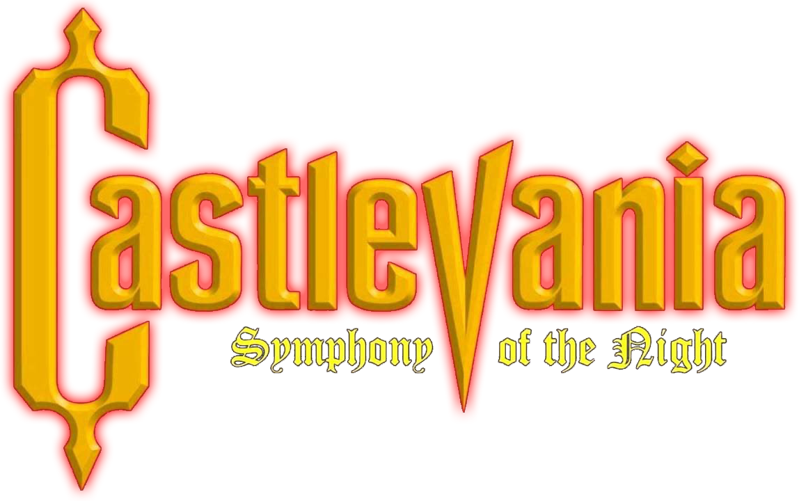

<h1 align=center>Castlevania: Symphony of the Night - Nintendo Switch port</h1>

This is a wrapper/port of the Android version of Castlevania: Symphony of the Night (v1.0.6).
It loads the original game binary, patches it and runs it.
It's basically as if we emulate a minimalist Android environment in which we natively run the original Android binary as is.

### How to install

You're going to need:
* the `.apk` for version **1.0.6**

To install:
1. Create a folder called `sotn` in the `switch` folder on your SD card.
2. The game data ships as `assets/res2`, a zip wrapping an OBB which is itself a zip.
   Unwrap it twice and copy the inner `assets/` tree to `/switch/sotn/assets/`.
3. Extract `lib/arm64-v8a/libsotn.so` from the `arm64-v8a` APK to `/switch/sotn/`.
4. Copy `sotn.nro` into `/switch/sotn/`.

Your SD card should contain: `/switch/sotn/sotn.nro`, `/switch/sotn/libsotn.so`
and the `/switch/sotn/assets/` data tree.

### Notes

This will not work in applet/album mode. Use a game override (hold R on a title) or a forwarder.

Save games and settings are stored in `/switch/sotn/save/`.

A `config.txt`  
`screen_width`/`screen_height`
`swap_ab` (`1` puts confirm/jump on B for a PlayStation layout).

### How to build

You're going to need devkitA64 and the following packages/libraries:
* `switch-mesa`
* `switch-libdrm_nouveau`
* `switch-sdl2`
* `switch-zlib`
* `devkitpro-pkgbuild-helpers`

### Credits

* TheOfficialFloW for the method and the original PS Vita work;
* fgsfds and Andy Nguyen for the so-loader this port is based on;

### Support

If you enjoy my work and want to support me :

### Legal

This project has no direct affiliation with Konami Digital Entertainment, Inc. or DotEmu.
"Castlevania" and "Castlevania: Symphony of the Night" are trademarks of their respective owners.
All Rights Reserved.

No assets or program code from the original game or its Android port are included in this project.
We do not condone piracy in any way, shape or form and encourage users to legally own the original game.

Unless specified otherwise, the source code provided in this repository is licenced under the MIT License.
Please see the accompanying LICENSE file.
